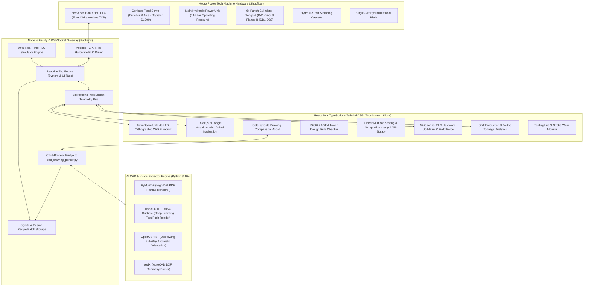

# HPT Innovance 6-Head CNC Angle Punching, Marking & Shearing SCADA System

[](https://nodejs.org/)
[](https://www.typescriptlang.org/)
[](https://react.dev/)
[](https://www.python.org/)
[](https://fastify.dev/)
[](https://threejs.org/)
[](https://tailwindcss.com/)
[](#)

> **Client:** Hydro Power Tech Engineering (HPT) — Ravki Industrial Area, Rajkot, Gujarat  
> **Target Machine:** Heavy Industrial Touchscreen Kiosk SCADA for CNC Transmission Tower Angle Steel Processing Lines (HPT-HA Series: HA-122, HA-163, HA-203, HA-253)  
> **PLC & Motion Controller:** Innovance H3U / H5U PLC (EtherCAT / Modbus TCP) + Innovance IS620N / IS810N High-Response Servo Drives

---

## 📋 Table of Contents
- [System Overview](#-system-overview)
- [System Architecture](#-system-architecture)
- [Key Features & Capabilities](#-key-features--capabilities)
  - [1. 2D Unfolded Orthographic CAD Blueprint](#1-2d-unfolded-orthographic-cad-blueprint)
  - [2. Interactive 3D Steel Angle Visualizer with D-Pad](#2-interactive-3d-steel-angle-visualizer-with-d-pad)
  - [3. AI CAD Blueprint & Drawing Importer](#3-ai-cad-blueprint--drawing-importer)
  - [4. Side-by-Side Drawing Comparison Modal](#4-side-by-side-drawing-comparison-modal)
  - [5. Full Responsive UI Architecture](#5-full-responsive-ui-architecture)
  - [6. Transmission Tower Design Rule Checker (IS 802 / ASTM A394)](#6-transmission-tower-design-rule-checker-is-802--astm-a394)
  - [7. Multibar Linear Nesting & Scrap Minimizer](#7-multibar-linear-nesting--scrap-minimizer)
  - [8. 32-Channel PLC Hardware I/O Signal Matrix](#8-32-channel-plc-hardware-io-signal-matrix)
  - [9. Shift Production, Metric Tonnage & OEE Analytics](#9-shift-production-metric-tonnage--oee-analytics)
  - [10. Tooling Life & Stroke Wear Monitor](#10-tooling-life--stroke-wear-monitor)
- [Monorepo Workspace Structure](#-monorepo-workspace-structure)
- [Prerequisites & Dependencies](#-prerequisites--dependencies)
- [Step-by-Step Installation](#-step-by-step-installation)
  - [1. Python Environment Setup](#1-python-environment-setup)
  - [2. Node.js Monorepo Setup](#2-nodejs-monorepo-setup)
- [Running the System](#-running-the-system)
- [Testing the AI CAD Parser](#-testing-the-ai-cad-parser)
- [PLC Communication Configuration](#-plc-communication-configuration)
- [Compliance & Standards](#-compliance--standards)
- [Authors & Credits](#-authors--credits)

---

## 📋 System Overview

The **HPT Innovance SCADA System** is an industrial-grade, touchscreen-optimized supervisory control and data acquisition (SCADA) platform engineered specifically for automated 6-head CNC angle punching, character stamping, and single-cut hydraulic shearing lines.

Operating at **20Hz telemetry update rates**, it bridges the physical Innovance PLC hardware and servo feed axis with a high-fidelity web and desktop kiosk UI. The system matches global structural steel fabrication standards (**Ficep Polaris & Steel Projects**, **Voortman VACAM**, and **Peddinghaus Raptor**), while adhering to Indian transmission line specifications (**GETCO, PGCIL, NTPC, KEC, Kalpataru, L&T**).

---

## 📐 System Architecture



---

## ✨ Key Features & Capabilities

### 1. 2D Unfolded Orthographic CAD Blueprint
* **Twin-Beam Unfolded CAD Layout**: Displays Flange A (top) and Flange B (bottom) separated along the central **Bend Heel Datum Line**, mirroring standard fabrication shop drawings.
* **Continuous CAD Centerlines**: Dashed-dotted centerlines at standard structural gauge lines: $56\text{ mm}$, $94\text{ mm}$, $112\text{ mm}$, and $128\text{ mm}$.
* **Vivid Color-Coded Tooling Stations**:
  * 🔵 **Flange A Punch Dies (DA1–DA3)**: Glowing Cyan rings ($\varnothing 14 - \varnothing 32\text{mm}$) with center drafting crosshairs.
  * 🟢 **Flange B Punch Dies (DB1–DB3)**: Glowing Emerald Green rings.
  * 🟡 **Marking Stamp Cassette**: Amber cassette stamp identification block.
  * 🔴 **Hydraulic Cutter**: Solid neon red shear cut line.
* **A.C.D. (Anti-Climbing Device) Callout**: Renders the vertical dashed capsule enclosing the 2 vertically stacked holes at $X = 4330.0\text{ mm}$ (Gauges $56\text{ mm}$ & $112\text{ mm}$) with its CAD leader callout line and landing bar `2 HOLES 17.5Ø FOR A.C.D`, plus witness lines for Gauge `94` and `96`.
* **Multi-Tier CAD Pitch Dimension Chains**: Lower and upper dimension chains with $45^\circ$ CAD witness tick marks, automatically handling offset intermediate holes and cumulative edge distances.
* **Real-Time Carriage Laser Track**: Moving neon laser line showing the physical servo gripper feed position in real time.

### 2. Interactive 3D Steel Angle Visualizer with D-Pad
* **True 3D Angle Profile Geometry**: Extruded structural steel $L$-angle profile ($L150\times 150\times 20$, $L200\times 200\times 24$, etc.) with metalness, roughness, and dynamic lighting.
* **Real Cylindrical Bores**: True 3D through-holes with chamfered rim rings and technical crosshairs.
* **Directional D-Pad On-Screen Controls**:
  * **Pan/Move**: Left, Right, Up, Down, and Zoom In/Out with mouse hold acceleration.
  * **Quick Navigation Jumps**: 1-click jumps to `Start (0%)`, `A.C.D (72%)`, and `End (100%)`.
  * **Navigation Modes**: Toggle between **Orbit/Rotate** and **Pan/Move** modes.
  * **Keyboard Shortcuts**: `←` / `→` for longitudinal travel, `↑` / `↓` for vertical tracking, `+` / `-` for zoom, `Home` / `End` for length jumps.

### 3. AI CAD Blueprint & Drawing Importer
* **Full File Format Support**:
  * Scanned & Vector PDFs (GETCO, PGCIL, NTPC, KEC, Kalpataru).
  * AutoCAD DXF/DWG vector CAD files (`CIRCLE`, `LINE`, `LWPOLYLINE`, `TEXT`, `MTEXT`).
  * Tekla Structures DSTV / NC1 structural steel files (`ST`, `BO`, `SI`, `IK` blocks).
* **Automatic 4-Way Orientation Detection**: Computes orientation scores using deep-learning OCR and computer vision deskewing so drawings are automatically rotated upright.
* **Title Block & Metadata Extraction**: Automatically parses Mark No (`NBS-601`), Section (`L150X150X20`), Cut Length (`6016 mm`), Quantity, Client, and Project name.

### 4. Side-by-Side Drawing Comparison Modal
* **Dual-Pane Verification**: Compares the original high-resolution scanned paper drawing against the generated 2D System Blueprint.
* **Synchronized Viewport Navigation**: Panning or zooming in either pane smoothly synchronizes the opposite viewport for pixel-perfect validation.
* **Complete Step Hole Schedule**: Collapsible data table displaying every punch operation (Side A/B, $X$, $Y$, Pitch, Diameter, Tool Die, Remarks) alongside IS 802 validation status badges.

### 5. Full Responsive UI Architecture
* **Universal Screen Adaptation**: Seamlessly scales across shopfloor touchscreen kiosks, operator tablets, engineering laptops, and external 4K HDMI monitors.
* **Smart Layout Adjustments**: Responsive top navigation bar, collapsible dimension chains, dynamic Canvas/WebGL canvas resizing, and touch-friendly controls.

### 6. Transmission Tower Design Rule Checker (IS 802 / ASTM A394)
* Automated engineering rule verification preventing bolt tear-out under high electrical line tension:
  * **Min Edge Distance**: $e_{min} \ge 1.5 \times \text{die diameter}$ from angle toe tip.
  * **Min Heel Gauge**: $g_{min} \ge 1.5 \times \text{die diameter} + \text{thickness}$ from bend heel fold.
  * **Min Pitch Spacing**: $p_{min} \ge 2.5 \times \text{die diameter}$ between consecutive holes.
* Configurable rule multipliers for specific tower client specifications (KEC, Kalpataru, L&T).

### 7. Multibar Linear Nesting & Scrap Minimizer
* Linear First-Fit Decreasing (FFD) multibar nesting algorithm.
* Automatically packs batch work orders into standard commercial raw stock bars ($6\text{m}, 9\text{m}, 12\text{m}$) with **$<1.2\%$ remnant scrap**.
* Configurable shear kerf blade loss and carriage gripper clamp dead-zones.

### 8. 32-Channel PLC Hardware I/O Signal Matrix
* Live visual status for **32 Digital Inputs ($X0–X37$)** and **32 Digital Outputs ($Y0–Y37$)** for Innovance H3U/H5U PLCs.
* Instant visual LED feedback for limit switches, proximity sensors, hydraulic pressure switches, and solenoid valves.
* **Field Force Mode**: Manual override triggers for field commissioning and maintenance without opening the electrical cabinet.

### 9. Shift Production, Metric Tonnage & OEE Analytics
* **Processed Metric Tonnage Calculator**: $\text{Tons} = \sum (\text{Length [m]} \times \text{Weight/m [kg]}) / 1000$.
* Shift tracking (Shift A, Shift B, Shift C) with runtime vs idle vs fault downtime breakdown.
* Full OEE Score (Availability $\times$ Performance $\times$ Quality).
* 1-click **Export Shift Production CSV** and **Printable Report**.

### 10. Tooling Life & Stroke Wear Monitor
* Stroke telemetry tracking for all 6 punch dies, marking cassette, and shear blade.
* Visual wear progress bars with **Regrind Due Alerts** at $>85\%$ wear.
* 1-click **Reset Counter after Regrind/Change**.

---

## 🏗️ Monorepo Workspace Structure

```
hptinnovanceanglepunchinghead6.test/
├── apps/
│   ├── client/                  # React 19 + Vite + Three.js + Tailwind CSS
│   │   ├── src/
│   │   │   ├── components/
│   │   │   │   ├── canvas/      # AngleBarVisualizer (2D) & AngleBar3DVisualizer (3D)
│   │   │   │   ├── importers/   # CadDrawingComparisonModal, DstvImporterModal
│   │   │   │   └── navigation/  # Responsive Navigation & Kiosk Toolbar
│   │   │   ├── views/           # SCADA Views (Production, Recipe, OEE, IO, Nesting)
│   │   │   ├── stores/          # Zustand Reactive PLC & Tag Stores
│   │   │   └── services/        # WebSocket client & REST API drivers
│   │   └── package.json
│   ├── server/                  # Fastify + WebSocket Server + Modbus Driver
│   │   ├── scripts/             # cad_drawing_parser.py (AI CAD Vision Extractor)
│   │   ├── src/
│   │   │   ├── plc/             # Innovance Modbus TCP driver & 20Hz Simulator
│   │   │   ├── importers/       # cadDrawingParser.ts (Child Process Bridge)
│   │   │   ├── routes/          # REST API (Recipes, Production, Tags, Alarms, Logs)
│   │   │   └── database/        # SQLite Persistence Engine
│   │   ├── requirements.txt     # Python dependencies for server scripts
│   │   └── package.json
│   └── desktop/                 # Electron Kiosk Desktop Wrapper
│       ├── src/                 # Main process, kiosk window manager
│       └── package.json
├── packages/
│   └── shared/                  # Shared TypeScript interfaces, PLC Tag schemas, Recipes
├── requirements.txt             # Root Python requirements file
├── package.json                 # Root monorepo configuration (npm workspaces)
└── README.md                    # System Documentation
```

---

## 📦 Prerequisites & Dependencies

### Hardware Requirements
* **Industrial PC / Touchscreen**: Quad-core x64 CPU, 8GB+ RAM, 1080p or 4K Touchscreen Display.
* **PLC Network**: Ethernet connection to Innovance H3U/H5U PLC (Default IP: `192.168.1.10:502`).

### Software Requirements
* **Node.js**: v20.x or higher
* **npm**: v10.x or higher
* **Python**: v3.10 to v3.12 x64 (with pip)
* **Git**: Installed and configured

---

## 🚀 Step-by-Step Installation

### 1. Python Environment Setup
The AI CAD Drawing Parser uses Python with deep learning OCR, computer vision, and vector CAD libraries.

```bash
# Verify Python version (>= 3.10)
python --version

# (Recommended) Create and activate a Python virtual environment
python -m venv venv

# On Windows:
.\venv\Scripts\activate

# On Linux/macOS:
source venv/bin/activate

# Install all required Python dependencies
pip install -r requirements.txt
```

#### Python Dependencies Included in `requirements.txt`:
| Package | Version | Purpose |
|---|---|---|
| `pymupdf` | `>=1.24.0` | High-DPI PDF rasterization and vector coordinate extraction |
| `rapidocr-onnxruntime` | `>=1.3.8` | High-speed offline deep-learning OCR for drawing annotations |
| `onnxruntime` | `>=1.17.0` | Cross-platform ONNX inference acceleration engine |
| `opencv-python` | `>=4.8.0` | Image processing, contour detection, binarization & deskewing |
| `numpy` | `>=1.24.0` | Fast coordinate transformations and geometry arrays |
| `ezdxf` | `>=1.1.0` | AutoCAD DXF/DWG vector entity parser |
| `pillow` | `>=10.0.0` | Image format conversion and base64 encoding |
| `shapely` | `>=2.0.0` | 2D computational geometry and polygon intersection |
| `pyclipper` | `>=1.3.0` | Polygon clipping and offset calculations |
| `reportlab` | `>=4.0.0` | Inspection sheet & calibration log PDF generation |

---

### 2. Node.js Monorepo Setup

```bash
# Install all root and workspace dependencies
npm install

# Build the shared TypeScript packages
npm run build:shared
```

---

## 🏃 Running the System

### Development Mode
Launches the Fastify server, the 20Hz real-time PLC simulator, and the Vite client application concurrently:
```bash
npm run dev
```
* **Client HMI UI**: [`http://localhost:3000`](http://localhost:3000)
* **REST & WebSocket API**: [`http://localhost:5000`](http://localhost:5000)

### Production Build
Compiles all TypeScript packages, bundles the client with Vite, and builds the server:
```bash
npm run build
```

### Desktop Touchscreen Kiosk Mode
Launches the full-screen Electron kiosk wrapper:
```bash
npm run start:kiosk
```

---

## 🧪 Testing the AI CAD Parser

You can test the standalone CAD extraction engine directly via the command line:

```bash
# Run extraction on sample transmission tower drawing
python apps/server/scripts/cad_drawing_parser.py TEST_R.pdf
```

The script will:
1. Automatically detect orientation and rotate the drawing upright.
2. OCR the title block to extract Mark No, Section, and Length ($6016\text{ mm}$).
3. Locate all punch holes on Flange A and Flange B.
4. Correctly identify the **2 HOLES 17.5Ø FOR A.C.D** at $X = 4330.0\text{ mm}$ (Gauges $56\text{ mm}$ & $112\text{ mm}$).
5. Output the complete recipe JSON payload with encoded image overlays.

---

## 🔌 PLC Communication Configuration

To connect to a physical **Innovance H3U / H5U PLC**:
1. Open [`apps/server/src/config/plcConfig.json`](file:///d:/Mindstien/hptinnovanceanglepunchinghead6.test/apps/server/src/config/plcConfig.json) or configure via the **PLC & UI Tag Master** view in the SCADA UI.
2. Set connection parameters:
   * **Protocol**: `Modbus TCP` (Default Port: `502`) or `EtherCAT / Serial RTU`
   * **PLC IP Address**: `192.168.1.10`
   * **Polling Scan Rate**: `50 ms` ($20\text{ Hz}$)
   * **Carriage Feed Axis Address**: Register `D1000` (Double Word 32-bit Float)
   * **Firing Solenoids**: Registers `M100 - M115`

---

## 📜 Compliance & Standards
* **IS 802**: Indian Standard for Use of Structural Steel in Overhead Transmission Line Towers.
* **IS 2062**: Hot Rolled Medium and High Tensile Structural Steel specifications.
* **ASTM A394**: Standard Specification for Steel Transmission Tower Bolts and Shear Tolerances.

---

## 👥 Authors & Credits
* **Client / Factory**: Hydro Power Tech Engineering (HPT), Ravki Industrial Area, Rajkot, Gujarat
* **Engineering & SCADA Development**: Mindstien Technologies / Rushabh Makim
