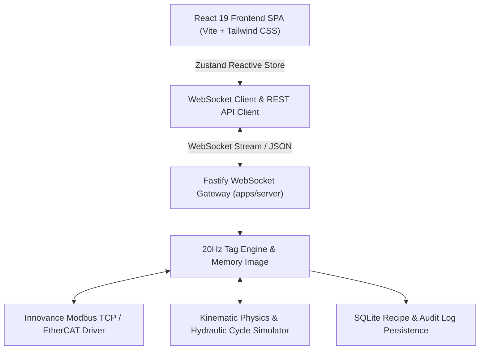

# System Architecture & Technical Deep-Dive

## 1. Architectural Philosophy

The **HPT Innovance 6-Head CNC Angle Line SCADA** application is designed around three fundamental industrial principles:
1. **Deterministic 20Hz Telemetry Loop**: Hardware IO and carriage feed coordinates are polled and pushed across WebSockets at a strict 50ms interval, ensuring zero visual lag on live digital DRO readouts.
2. **State Isolation**: UI state management (Zustand) is decoupled from the hardware driver layer, allowing the HMI to switch between physical Innovance PLCs and the built-in real-time simulator seamlessly.
3. **Touchscreen Ergonomics**: Designed for gloved operators on 15"–24" industrial IP65 panel PCs.

---

## 2. Layered Technology Stack

### A. Frontend Layer (`apps/client`)
* **Framework**: React 19 + TypeScript.
* **Styling & Tokens**: Custom Industrial Color Admin Design System (Tailwind CSS) with high-contrast slate panels, tactile push-buttons, and dual-state LED indicators.
* **Canvas Engine**: HTML5 2D Canvas rendering with device pixel ratio scaling, independent flange height normalization, and sub-pixel alignment.
* **State Management**: Zustand store (`usePlcStore.ts`) providing instantaneous batch updates without unnecessary component re-renders.

### B. Gateway & Server Layer (`apps/server`)
* **Framework**: Fastify with high-throughput WebSocket plugin.
* **Tag Engine**: In-memory 32-bit register table mapping Innovance PLC memory addresses ($D, M, X, Y$ registers) to human-readable SCADA tags (`Carriage_Target_Pos`, `DA1_Punch_Fire`, etc.).
* **Simulator**: Kinematic motor simulation modeling rack-and-pinion carriage acceleration ($28.5\text{ m/min}$), hydraulic pressure curves ($145\text{ bar}$), and tooling stroke dwell times.

### C. Shared Domain Layer (`packages/shared`)
* **Models**: `ItemRecipe`, `ItemRecipeStep`, `ProductionCycle`, `PlcTag`, `AlarmEvent`, and `NestingOrder`.
* Single source of truth for both client and server, guaranteeing 100% type safety.

---

## 3. Communication Protocol & Tag Mapping

| Memory Address | Tag Name | Type | Unit | Description |
|---|---|---|---|---|
| `D1000-D1001` | `Carriage_Actual_Pos` | Float32 | mm | Actual feed axis position from linear encoder |
| `D1002-D1003` | `Carriage_Target_Pos` | Float32 | mm | Commanded target coordinate from SCADA |
| `D1004` | `Carriage_Speed_Feed` | Int16 | 0.1 m/min | Live carriage velocity |
| `D1010` | `HPU_Pressure_Actual` | Int16 | 0.1 bar | Main hydraulic manifold pressure transducer |
| `M100` | `Machine_Auto_Mode` | Boolean | - | Machine is running in automated cycle |
| `M101` | `HPU_Motor_Run_Cmd` | Boolean | - | Start/Stop command for main hydraulic pump |
| `M110` | `DA1_Punch_Down_Cmd` | Boolean | - | Solenoid fire command for Flange A Station 1 |
| `M111` | `DA2_Punch_Down_Cmd` | Boolean | - | Solenoid fire command for Flange A Station 2 |
| `M112` | `DA3_Punch_Down_Cmd` | Boolean | - | Solenoid fire command for Flange A Station 3 |
| `M113` | `DB1_Punch_Down_Cmd` | Boolean | - | Solenoid fire command for Flange B Station 1 |
| `M114` | `DB2_Punch_Down_Cmd` | Boolean | - | Solenoid fire command for Flange B Station 2 |
| `M115` | `DB3_Punch_Down_Cmd` | Boolean | - | Solenoid fire command for Flange B Station 3 |
| `M120` | `Marking_Down_Cmd` | Boolean | - | Marking cassette hydraulic cylinder |
| `M121` | `Shear_Cut_Down_Cmd` | Boolean | - | Hydraulic shear blade single-cut stroke |
| `X0 - X37` | `Digital_Inputs` | Bit Array | - | 32 Physical PLC inputs (limits, proximities, e-stop) |
| `Y0 - Y37` | `Digital_Outputs` | Bit Array | - | 32 Physical PLC outputs (relays, valves, beacons) |
