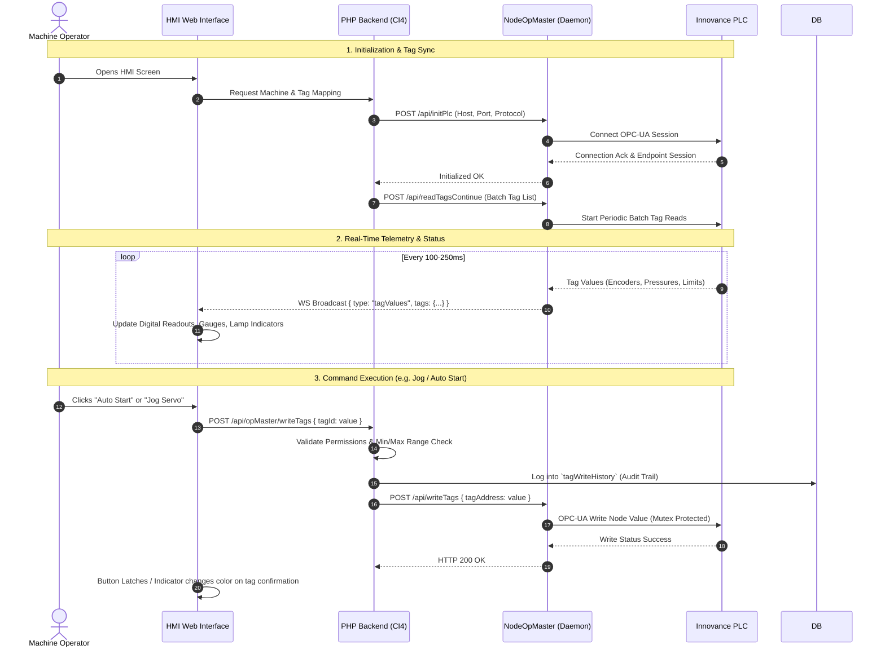

# System Architecture & Technical Design

---

## 1. Overview
The software operates as a high-reliability distributed industrial control architecture split into three distinct layers:
1. **Physical PLC Layer**: Innovance Industrial PLC executing deterministic ladder/structured-text logic for servos, hydraulic cylinders, pressure switches, and safety sensors.
2. **Gateway Daemon Layer (`nodeOpMaster`)**: A high-performance Node.js background service maintaining persistent OPC-UA communication, real-time polling loops, and bi-directional WebSocket broadcasting.
3. **Application & HMI Layer (CodeIgniter 4 + Web HMI)**: An enterprise-grade modular web backend managing recipes, planning algorithms, user permissions, audit logs, and rendering the operator interface.

```mermaid
flowchart TD
    subgraph PLC_Layer ["Industrial Field Layer"]
        PLC["Innovance PLC\n(OPC-UA Server @ opc.tcp://192.168.1.x:4840)"]
        Sensors["Proximity Switches, Linear Encoders,\nPressure Transducers, Safety Light Curtains"]
        Actuators["Servo Infeed Carriage, Hydraulic Punches (DA1-3, DB1-3),\nMarking Cassettes (1-4), Hydraulic Cutter"]
        PLC <--> Sensors
        PLC <--> Actuators
    end

    subgraph Node_Layer ["Gateway Daemon Layer (nodeOpMaster)"]
        OPCClient["OPC-UA Client\n(node-opcua Session Pool)"]
        PollLoop["Continuous Polling Loop\n(Configurable Interval, e.g. 100-250ms)"]
        MutexLock["Async-Mutex Concurrency Controller\n(Prevents Race Conditions)"]
        AlarmEngine["Alarm Engine (LOLO, LO, HI, HIHI)\n(State Machine & Threshold Checks)"]
        WSServer["WebSocket Server (:3001)\n(Real-Time Browser Broadcast)"]
        NodeAPI["Express REST API (:3000)\n(Internal Command Endpoints)"]

        PLC <-->|OPC-UA Protocol| OPCClient
        OPCClient --> PollLoop
        PollLoop --> MutexLock
        MutexLock --> AlarmEngine
        AlarmEngine --> WSServer
        PollLoop --> WSServer
        NodeAPI --> MutexLock
    end

    subgraph App_Layer ["Application & UI Layer"]
        HMI["Industrial Touchscreen HMI\n(HTML5 / Bootstrap / Custom SCADA UI Engine)"]
        CI4["CodeIgniter 4 Backend\n(Modules: OpMaster, ItemRecipeMaster, programAlignMaster)"]
        DB[(MySQL / MariaDB)]

        HMI <-->|WebSocket Events (Sub-second Live DRO)| WSServer
        HMI <-->|HTTP / AJAX JSON| CI4
        CI4 <-->|REST API / IPC| NodeAPI
        CI4 <-->|SQL Queries / PDO| DB
    end
```

---

## 2. Gateway Layer Architecture (`nodeOpMaster`)

### 2.1 OPC-UA Connection Lifecycle
* **Client Implementation**: Built using the official `node-opcua` standard library.
* **Keep-Alive & Session Management**:
  - Automatically recovers from network disconnects or PLC power cycles using exponential retry strategies.
  - Re-establishes session subscriptions upon connection restore.
* **Tag Polling Loop**:
  - Tags configured with continuous reading are periodically sampled in batches.
  - Double precision floats are rounded to 3 decimal places for transmission efficiency.
* **Atomic Tag Writes with Mutex**:
  - Write commands from UI or backend pass through `async-mutex` to guarantee that concurrent reads/writes do not collide or produce race conditions on the OPC-UA session.

### 2.2 WebSocket Communication Protocol
The WebSocket server (`nodeOpMaster/wsServer.js`) operates on port `3001` and broadcasts four core message types:

| Message Type | Payload Structure | Description |
| :--- | :--- | :--- |
| `tagValues` | `{ type: "tagValues", tags: { [tagId]: value, ... } }` | Live values of polled tags sent to all connected HMI clients. |
| `plcStatus` | `{ type: "plcStatus", status: "connected"|"disconnected"|"error", message: string }` | Live connection health state of the PLC. |
| `alarm` | `{ type: "alarm", alarmId: string, level: string, value: number, active: boolean, timestamp: string }` | Instant notification when an analog or digital alarm triggers/clears. |
| `operation` | `{ type: "operation", status: string, stepIndex: number, details: object }` | Execution progress updates during auto-cycle production. |

### 2.3 Systemd Daemon Management
The NodeOpMaster service runs as a native Linux daemon (`scada-node.service`). The PHP backend provides built-in system service control via `OpMasterFront::manageNodeApp()`:
* **Start**: `sudo systemctl start scada-node.service`
* **Stop**: `sudo systemctl stop scada-node.service`
* **Restart**: `sudo systemctl restart scada-node.service`
* **Status Check**: `sudo systemctl is-active scada-node.service`
* **Live Logs**: `sudo journalctl -u scada-node.service -n 100 --no-pager`

---

## 3. Backend Modular Architecture (CodeIgniter 4)

The backend is structured into autonomous, highly cohesive modules located under `Modules/Backend/` and `Modules/Frontend/`, dynamically registered via `app/Config/Autoload.php`:

```
Modules/
├── Backend/
│   ├── OpMaster/              # Operator control backend & node daemon IPC
│   ├── ItemRecipeMaster/      # Part recipe management & DAT parser
│   ├── programAlignMaster/    # Nesting and multi-part bar optimization
│   ├── productionMasters/     # Production batch tracking and execution records
│   ├── MachineMaster/         # Physical head positions, setup configs, tool sizes
│   ├── PlcMaster/             # PLC IP, port, protocol, tag tables
│   ├── UiTagMaster/           # UI data binding & min/max safety limits
│   ├── AalarmModules/         # Alarm definitions, thresholds, and historical logs
│   ├── punchCounters/         # Tool life hit counters and wear warnings
│   ├── jobCards/              # Production orders and target quantities
│   └── System/                # Core settings, user authentication, RBAC
└── Frontend/
    ├── OpMaster/              # SCADA screens: autoControl, manualControl, homing, machineParameters
    ├── ItemRecipeMaster/      # Recipe editor & visual part preview
    ├── programAlignMaster/    # Bar alignment & nesting visualizer
    ├── productionMasters/     # Live execution queue & batch monitoring
    └── ...
```

---

## 4. End-to-End Execution Flow


