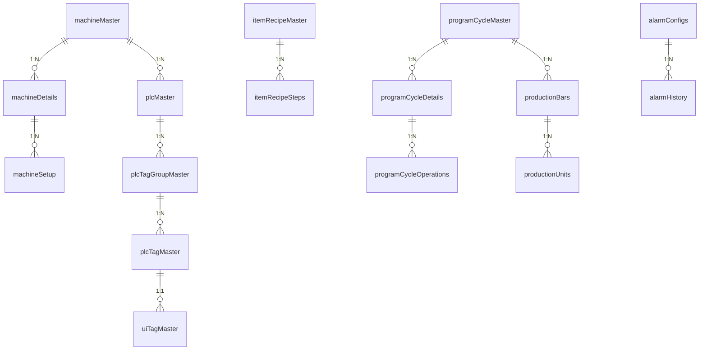

# Database Schema Reference

---

## 1. Relational Database Overview
The application database uses MySQL / MariaDB engine (InnoDB) with foreign key constraints, UTF8mb4 encoding, and tenant-level multi-tenancy isolation (`tenantId`).

---

## 2. Table Data Dictionaries

### 2.1 Machine & Hardware Tables

#### `machineMaster`
| Column | Type | Null | Default | Description |
| :--- | :--- | :--- | :--- | :--- |
| `machineId` (PK) | INT UNSIGNED | NO | AUTO_INC | Unique machine ID |
| `tenantId` | INT UNSIGNED | NO | | Tenant identifier |
| `machineCode` | VARCHAR(50) | NO | | Unique code e.g. "HPT-PUNCH-01" |
| `machineName` | VARCHAR(100) | NO | | Name e.g. "Innovance 6-Head Puncher" |
| `headCount` | INT | NO | 6 | Total punch heads (3 on A, 3 on B) |
| `barMaxLength` | FLOAT | NO | 12000.00 | Max raw bar length in mm |
| `defaultLeadScrap` | FLOAT | NO | 50.00 | Standard lead cut margin in mm |
| `defaultPrincherScrap` | FLOAT | NO | 45.00 | Standard tail clamp margin in mm |

#### `machineDetails`
| Column | Type | Null | Default | Description |
| :--- | :--- | :--- | :--- | :--- |
| `machineDetailId` (PK) | INT UNSIGNED | NO | AUTO_INC | Unique station ID |
| `machineId` (FK) | INT UNSIGNED | NO | | References `machineMaster.machineId` |
| `headName` | VARCHAR(50) | NO | | Name: 'DA1', 'DA2', 'DA3', 'DB1', 'DB2', 'DB3', 'Marking', 'Cutter' |
| `headType` | ENUM | NO | | 'Punching', 'Marking', 'Cutting' |
| `side` | ENUM | NO | 'N/A' | 'A', 'B', 'N/A' |
| `xPosition` | DECIMAL(10,3) | NO | | Longitudinal offset distance in mm |

#### `machineSetup`
| Column | Type | Null | Default | Description |
| :--- | :--- | :--- | :--- | :--- |
| `machineSetupId` (PK) | INT UNSIGNED | NO | AUTO_INC | Unique setup ID |
| `machineDetailId` (FK) | INT UNSIGNED | NO | | References `machineDetails.machineDetailId` |
| `childId` | INT | NO | 0 | Sub-index (e.g. cassette index 1-4) |
| `value` | VARCHAR(100) | NO | | Installed punch die size (e.g. '20') |

---

### 2.2 PLC & UI Tag Tables

#### `plcMaster`
| Column | Type | Null | Default | Description |
| :--- | :--- | :--- | :--- | :--- |
| `plcId` (PK) | INT UNSIGNED | NO | AUTO_INC | Unique PLC ID |
| `machineId` (FK) | INT UNSIGNED | NO | | References `machineMaster.machineId` |
| `plcName` | VARCHAR(100) | NO | | Name e.g. "Innovance H5U" |
| `protocol` | ENUM | NO | 'opc-ua' | 'opc-ua', 'modbus-tcp', 'mqtt' |
| `ipAddress` | VARCHAR(50) | NO | | IP Address e.g. "192.168.1.100" |
| `port` | INT | NO | 4840 | Port number |

#### `plcTagMaster`
| Column | Type | Null | Default | Description |
| :--- | :--- | :--- | :--- | :--- |
| `tagId` (PK) | INT UNSIGNED | NO | AUTO_INC | Unique Tag ID |
| `plcId` (FK) | INT UNSIGNED | NO | | References `plcMaster.plcId` |
| `tagName` | VARCHAR(100) | NO | | Descriptive tag name |
| `tagAddress` | VARCHAR(255) | NO | | OPC-UA NodeId e.g. "ns=2;s=Application.GVL.X_POS" |
| `dataType` | ENUM | NO | | 'bool', 'int16', 'int32', 'float', 'double', 'string' |

#### `uiTagMaster`
| Column | Type | Null | Default | Description |
| :--- | :--- | :--- | :--- | :--- |
| `uiTagId` (PK) | INT UNSIGNED | NO | AUTO_INC | Unique UI Tag mapping ID |
| `tagId` (FK) | INT UNSIGNED | NO | | References `plcTagMaster.tagId` |
| `controlType` | ENUM | NO | | 'momentary', 'maintain', 'latched', 'dro', 'input', 'gauge' |
| `minValue` | DECIMAL(10,3) | YES | NULL | Minimum safety limit |
| `maxValue` | DECIMAL(10,3) | YES | NULL | Maximum safety limit |

---

### 2.3 Recipe & Planning Tables

#### `itemRecipeMaster`
| Column | Type | Null | Default | Description |
| :--- | :--- | :--- | :--- | :--- |
| `itemRecipeId` (PK) | INT UNSIGNED | NO | AUTO_INC | Unique recipe ID |
| `itemCode` | VARCHAR(100) | NO | | Part code e.g. "TWR-101-A" |
| `sideAWidth` | DECIMAL(10,2) | NO | | Flange A width in mm |
| `sideBWidth` | DECIMAL(10,2) | NO | | Flange B width in mm |
| `thickness` | DECIMAL(10,2) | NO | | Thickness in mm |
| `totalLength` | DECIMAL(10,2) | NO | | Finished piece length in mm |

#### `itemRecipeSteps`
| Column | Type | Null | Default | Description |
| :--- | :--- | :--- | :--- | :--- |
| `itemRecipeStepId` (PK) | INT UNSIGNED | NO | AUTO_INC | Unique step ID |
| `itemRecipeId` (FK) | INT UNSIGNED | NO | | References `itemRecipeMaster.itemRecipeId` |
| `ordId` | INT | NO | 0 | Sequence order |
| `opType` | ENUM | NO | | 'Punching', 'Marking', 'Cutting' |
| `side` | ENUM | NO | 'N/A' | 'A', 'B', 'N/A' |
| `opValue` | VARCHAR(100) | NO | | Tool diameter or marking text |
| `xPos` | DECIMAL(10,3) | NO | | Absolute longitudinal coordinate |
| `yPos` | DECIMAL(10,3) | NO | | Transverse gauge distance |

#### `programCycleMaster`
| Column | Type | Null | Default | Description |
| :--- | :--- | :--- | :--- | :--- |
| `cycleId` (PK) | INT UNSIGNED | NO | AUTO_INC | Unique cycle plan ID |
| `barLength` | DECIMAL(10,2) | NO | | Raw steel bar length in mm |
| `leadScrap` | DECIMAL(10,2) | NO | | Calculated lead scrap in mm |
| `princherScrap` | DECIMAL(10,2) | NO | | Calculated tail clamp scrap in mm |
| `completedCycles` | INT | NO | 0 | Number of completed raw bars |

#### `programCycleOperations`
| Column | Type | Null | Default | Description |
| :--- | :--- | :--- | :--- | :--- |
| `operationId` (PK) | BIGINT UNSIGNED | NO | AUTO_INC | Unique tool operation ID |
| `cycleDetailsId` (FK) | INT UNSIGNED | NO | | References `programCycleDetails.cycleDetailsId` |
| `machineDetailId` (FK) | INT UNSIGNED | NO | | Target station (`DA1`-`DB3`, `Mark`, `Cut`) |
| `xPos` | DECIMAL(10,3) | NO | | Machine infeed coordinate |
| `yPos` | DECIMAL(10,3) | NO | | Transverse coordinate |
| `status` | ENUM | NO | 'waiting' | 'waiting', 'started', 'completed', 'skipped', 'error' |
