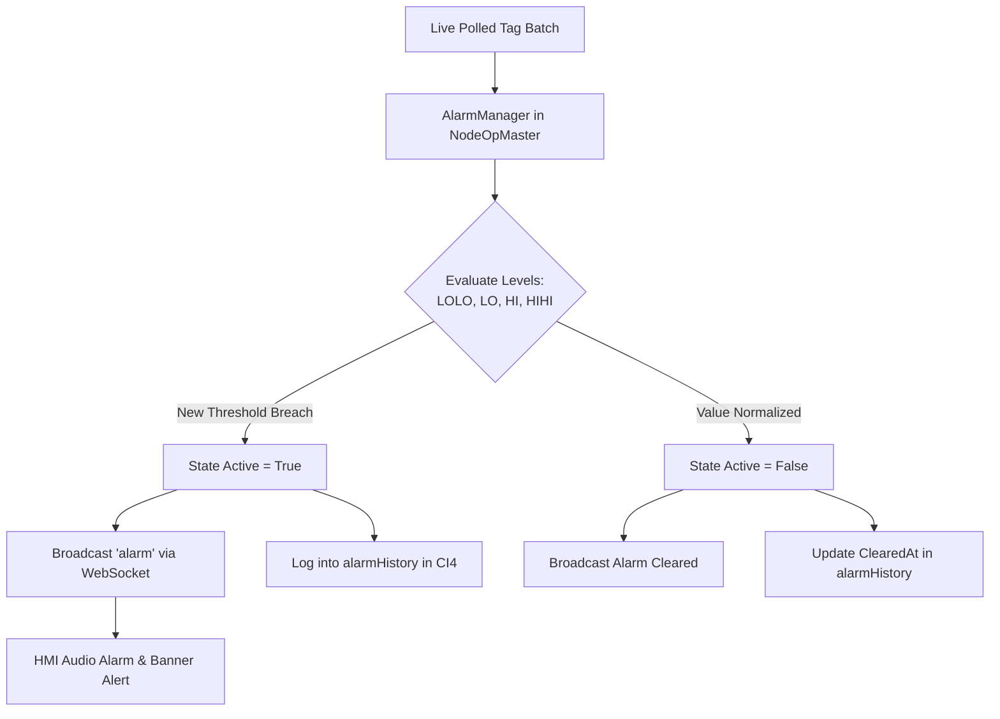
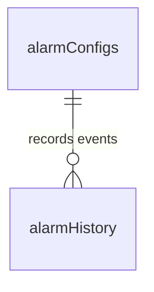

# Alarms, Diagnostics & Safety System

---

## 1. Overview
The alarm and safety framework is divided into two distinct monitoring systems:
1. **PLC Hardware Alarms**: Emergency stop circuits, servo drive fault codes, hydraulic over-temperature trips, safety light curtain breaches, and motor overload relays.
2. **Software-Side Threshold Alarms (`alarmManager.js` & `AalarmModules`)**: Software-defined analog and digital limits that continuously inspect live PLC tag values (such as oil pressure, motor current, cylinder cycle times, and temperature).



---

## 2. Analog Alarm Level Definitions

For analog parameters (e.g. Hydraulic System Pressure):

| Alarm Level | Identifier | Severity | Typical Action |
| :--- | :--- | :--- | :--- |
| **LOLO** (Low-Low) | `lolo` | Critical | Emergency Cycle Inhibit / Stop Pump |
| **LO** (Low) | `lo` | Warning | Warning Banner / Notify Operator |
| **Normal** | `normal` | OK | Normal Operation |
| **HI** (High) | `hi` | Warning | Warning Banner / Notify Operator |
| **HIHI** (High-High) | `hihi` | Critical | Emergency Cycle Inhibit / Unload Pressure |

```
──┬─── HIHI Threshold (e.g. 230 Bar) ────► [CRITICAL ALARM & INTERLOCK]
  │
  ├─── HI Threshold (e.g. 210 Bar) ──────► [WARNING BANNER]
  │
  │    NORMAL OPERATING RANGE
  │
  ├─── LO Threshold (e.g. 140 Bar) ──────► [WARNING BANNER]
  │
──┴─── LOLO Threshold (e.g. 110 Bar) ────► [CRITICAL ALARM & INTERLOCK]
```

---

## 3. Database Schema



### 3.1 Table: `alarmConfigs`
Defines the monitoring rules per PLC tag.

```sql
CREATE TABLE `alarmConfigs` (
    `alarmId` INT UNSIGNED AUTO_INCREMENT PRIMARY KEY,
    `tenantId` INT UNSIGNED NOT NULL,
    `tagId` INT UNSIGNED NOT NULL,             -- Monitored PLC Tag
    `alarmName` VARCHAR(100) NOT NULL,
    `loloLimit` DECIMAL(10,3) NULL,
    `loLimit` DECIMAL(10,3) NULL,
    `hiLimit` DECIMAL(10,3) NULL,
    `hihiLimit` DECIMAL(10,3) NULL,
    `message` VARCHAR(255) NOT NULL,
    `isActive` TINYINT DEFAULT 1,
    `createdAt` DATETIME NULL,
    `updatedAt` DATETIME NULL
);
```

### 3.2 Table: `alarmHistory`
Maintains a tamper-proof historical record of every alarm incident, duration, and clearing time.

```sql
CREATE TABLE `alarmHistory` (
    `historyId` BIGINT UNSIGNED AUTO_INCREMENT PRIMARY KEY,
    `tenantId` INT UNSIGNED NOT NULL,
    `alarmId` INT UNSIGNED NOT NULL,
    `level` ENUM('lolo', 'lo', 'hi', 'hihi', 'digital') NOT NULL,
    `triggerValue` DECIMAL(10,3) NOT NULL,
    `triggeredAt` DATETIME NOT NULL,
    `clearedAt` DATETIME NULL,
    `durationSeconds` INT NULL,
    `acknowledgedBy` INT UNSIGNED NULL,
    FOREIGN KEY (`alarmId`) REFERENCES `alarmConfigs`(`alarmId`) ON DELETE CASCADE
);
```

---

## 4. State Machine & Edge Detection (`alarmManager.js`)

To prevent alert storms and excessive database traffic:
* **Edge Detection**: An alarm event is triggered **only once** on the transition from normal to breached state (`0` $\to$ `1`).
* **Active State Persistence**: The NodeOpMaster daemon maintains a live in-memory state map (`activeStates`). When the daemon restarts, active alarms are restored from the database to ensure state continuity.
* **Instant Notification**: When an alarm occurs, NodeOpMaster broadcasts an immediate WebSocket payload containing `{ type: "alarm", alarmId, level, value, active: true }`. The HMI displays an interactive banner and triggers an industrial audio alert.
