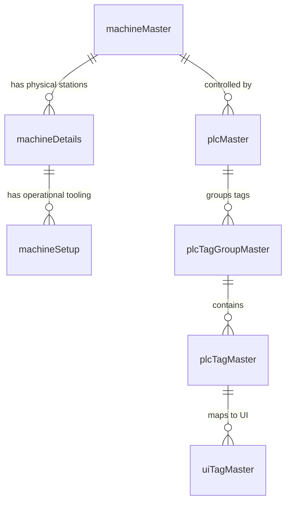

# Machine & PLC Configuration

---

## 1. Machine Hardware Overview
The HPT Innovance 6-Head Angle Punching Machine is an integrated CNC machine designed for rapid hole punching, part marking, and shearing of equal and unequal steel angles.

```
Longitudinal Infeed Direction (X-Axis) ───────────────────────────────►
┌──────────────┐     ┌──────────────┐     ┌──────────────┐     ┌──────────────┐
│  Marking Unit│     │ Punch Head A │     │ Punch Head B │     │Shearing Blade│
│ (4 Cassettes)│     │(DA1, DA2, DA3)│     │(DB1, DB2, DB3)│    │(Cutting Tool)│
│  Offset: X_m │     │  Offsets: X_a│     │  Offsets: X_b│     │  Offset: X_c │
└──────────────┘     └──────────────┘     └──────────────┘     └──────────────┘
```

### 1.1 Physical Station Breakdown

| Station Name | Identifier | Flange / Side | Description | Tooling Range |
| :--- | :--- | :--- | :--- | :--- |
| **Punch Head A1** | `DA1` | Side A | High-speed hydraulic punch cylinder #1 | Ø12mm - Ø32mm |
| **Punch Head A2** | `DA2` | Side A | High-speed hydraulic punch cylinder #2 | Ø12mm - Ø32mm |
| **Punch Head A3** | `DA3` | Side A | High-speed hydraulic punch cylinder #3 | Ø12mm - Ø32mm / Slot tool |
| **Punch Head B1** | `DB1` | Side B | Perpendicular hydraulic punch cylinder #1 | Ø12mm - Ø32mm |
| **Punch Head B2** | `DB2` | Side B | Perpendicular hydraulic punch cylinder #2 | Ø12mm - Ø32mm |
| **Punch Head B3** | `DB3` | Side B | Perpendicular hydraulic punch cylinder #3 | Ø12mm - Ø32mm / Slot tool |
| **Marking Unit** | `Marking 1-4` | Side A/B (Center) | 4 individual stamping cassettes | Alphanumeric characters |
| **Shearing Unit** | `Cutter` | Both Sides | Heavy-duty hydraulic angle cutter | 40x40x3 to 200x200x20 mm |
| **Servo Carriage** | `Princher` | Longitudinal | High-torque servo with clamping jaws | 0mm to 14,000mm travel |

---

## 2. Machine Database Schema & Relational Model



### 2.1 Table: `machineMaster`
Stores physical machine profiles, serial numbers, and maximum processing limits.

```sql
CREATE TABLE `machineMaster` (
    `machineId` INT UNSIGNED AUTO_INCREMENT PRIMARY KEY,
    `tenantId` INT UNSIGNED NOT NULL,
    `serialNo` INT UNSIGNED DEFAULT 0,
    `machineCode` VARCHAR(50) NOT NULL UNIQUE,
    `machineName` VARCHAR(100) NOT NULL,
    `machineType` VARCHAR(100) DEFAULT 'SKIPPER',
    `headCount` INT DEFAULT 6,
    `barMaxLength` FLOAT DEFAULT 12000.00,
    `barUom` VARCHAR(10) DEFAULT 'mm',
    `defaultLeadScrap` FLOAT DEFAULT 50.00,
    `defaultPrincherScrap` FLOAT DEFAULT 45.00,
    `isActive` TINYINT DEFAULT 1,
    `createdAt` DATETIME NULL,
    `updatedAt` DATETIME NULL
);
```

### 2.2 Table: `machineDetails` (Physical Stations)
Defines each physical station's permanent $X$-axis distance offset from the machine reference zero point.

```sql
CREATE TABLE `machineDetails` (
    `machineDetailId` INT UNSIGNED AUTO_INCREMENT PRIMARY KEY,
    `tenantId` INT UNSIGNED NOT NULL,
    `serialNo` INT UNSIGNED DEFAULT 0,
    `machineId` INT UNSIGNED NOT NULL,
    `headName` VARCHAR(50) NOT NULL,           -- e.g. "DA1", "DB1", "Marking1", "Cutter"
    `headType` ENUM('Punching', 'Marking', 'Cutting') NOT NULL,
    `side` ENUM('N/A', 'A', 'B') DEFAULT 'N/A',
    `xPosition` DECIMAL(10,3) NOT NULL,        -- Physical X distance offset in mm
    `markingCassets` INT DEFAULT 0,
    `isActive` TINYINT DEFAULT 1,
    FOREIGN KEY (`machineId`) REFERENCES `machineMaster`(`machineId`) ON DELETE CASCADE
);
```

### 2.3 Table: `machineSetup` (Operational Tooling)
Represents the dynamic tooling loaded into each station for a given shift or production run.

```sql
CREATE TABLE `machineSetup` (
    `machineSetupId` INT UNSIGNED AUTO_INCREMENT PRIMARY KEY,
    `tenantId` INT UNSIGNED NOT NULL,
    `serialNo` INT UNSIGNED DEFAULT 0,
    `machineDetailId` INT UNSIGNED NOT NULL,
    `childId` INT DEFAULT 0,                   -- For marking cassette index (1-4)
    `value` VARCHAR(100) NOT NULL,             -- e.g. "25" (Ø25mm punch) or "A-Z"
    `updatedAt` DATETIME NULL,
    FOREIGN KEY (`machineDetailId`) REFERENCES `machineDetails`(`machineDetailId`) ON DELETE CASCADE
);
```

---

## 3. PLC Master & Tag Configuration

### 3.1 Table: `plcMaster`
Stores IP address, connection port, and protocol parameters for the Innovance PLC.

```sql
CREATE TABLE `plcMaster` (
    `plcId` INT UNSIGNED AUTO_INCREMENT PRIMARY KEY,
    `tenantId` INT UNSIGNED NOT NULL,
    `serialNo` INT UNSIGNED DEFAULT 0,
    `machineId` INT UNSIGNED NOT NULL,
    `plcName` VARCHAR(100) NOT NULL,
    `protocol` ENUM('opc-ua', 'modbus-tcp', 'mqtt') DEFAULT 'opc-ua',
    `ipAddress` VARCHAR(50) NOT NULL,          -- e.g. "192.168.1.100"
    `port` INT NOT NULL DEFAULT 4840,          -- Standard OPC-UA port
    `status` TINYINT DEFAULT 1,
    FOREIGN KEY (`machineId`) REFERENCES `machineMaster`(`machineId`) ON DELETE CASCADE
);
```

### 3.2 Table: `plcTagMaster`
Maintains the complete dictionary of PLC memory nodes (OPC-UA node IDs or Modbus registers).

```sql
CREATE TABLE `plcTagMaster` (
    `tagId` INT UNSIGNED AUTO_INCREMENT PRIMARY KEY,
    `tenantId` INT UNSIGNED NOT NULL,
    `serialNo` INT UNSIGNED DEFAULT 0,
    `plcId` INT UNSIGNED NOT NULL,
    `tagGroupId` INT UNSIGNED NULL,
    `tagName` VARCHAR(100) NOT NULL,           -- e.g. "S_ACTUAL_CARRIAGE_POS"
    `tagAddress` VARCHAR(255) NOT NULL,        -- OPC-UA NodeId e.g. "ns=2;s=Application.GVL.S_ACT_POS"
    `dataType` ENUM('bool', 'int16', 'int32', 'float', 'double', 'string') NOT NULL,
    `registerType` ENUM('holding', 'coil', 'input', 'variable') DEFAULT 'holding',
    `readWrite` ENUM('read', 'write', 'readWrite') DEFAULT 'readWrite',
    `scaleFactor` FLOAT DEFAULT 1.0,
    `offset` FLOAT DEFAULT 0.0,
    `unit` VARCHAR(20) NULL,
    `isActive` TINYINT DEFAULT 1,
    FOREIGN KEY (`plcId`) REFERENCES `plcMaster`(`plcId`) ON DELETE CASCADE
);
```

---

## 4. Tag Synchronization Workflow

To ensure seamless alignment between the Innovance PLC address space and the web database:
1. **Online Tag Scan (`/api/syncTags`)**: The NodeOpMaster daemon browses the PLC OPC-UA address space hierarchy under `Application.GVL` (Global Variable List).
2. **Database Reconciliation (`OpMasterFront::syncTags`)**: The backend compares discovered node IDs with existing records in `plcTagMaster` and automatically inserts new tags, updates modified data types, and reports diff statistics (`deletedRows`, `updatedRows`, `insertedRows`).
3. **Continuous Polling Setup (`OpMasterFront::initPlc`)**: When the HMI connects, the backend sends a curated map of active monitoring tags to NodeOpMaster to start high-speed polling loops.
