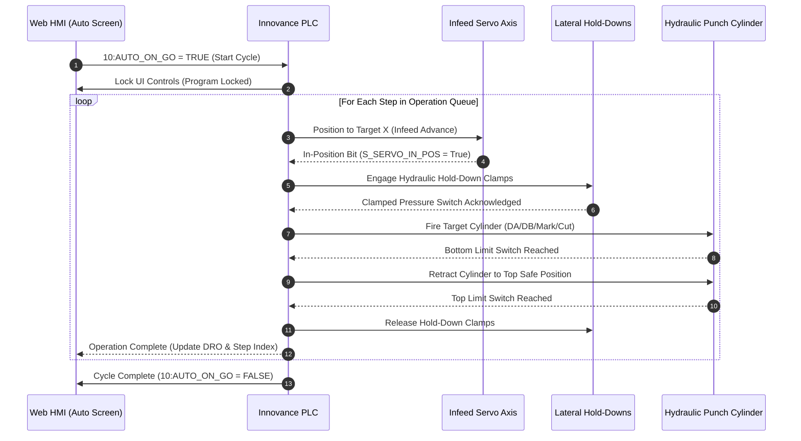

# Operator HMI & CNC Machine Control

---

## 1. HMI Screen Structure
The Operator Interface is designed as an industrial touch-optimized Single Page Application (SPA) located under `Modules/Frontend/OpMaster/Views/`:

```
OpMaster Views/
├── start.php                # Master HMI container with toolbar and SPA screen loader
├── autoControl.php          # Real-time automated CNC production screen
├── manualControl.php        # Manual jogging of servos, hydraulic punches, and clamps
├── homing.php               # Machine zero-point referencing and calibration
├── machineParameters.php    # Machine physical constants, speeds, and timing settings
└── programPrepare.php       # Job selection, plan preview, and execution launch
```

---

## 2. Auto Production Screen (`autoControl.php`)

```
┌──────────────────────────────────────────────────────────────────────────┐
│ [PROGRAM: TWR-ANGLE-100]  BAR: 12000mm  LEAD: 50mm  PRINCHER: 65mm       │
├──────────────────────────────────────────────────────────────────────────┤
│ LIVE DRO:  X = 4,250.50 mm │ HYD PRESSURE: 185 Bar │ STATUS: IN-CYCLE    │
├──────┬──────┬──────┬─────────┬─────────┬─────────┬────────┬──────────────┤
│ Step │ Side │ Head │ Tool    │ X (mm)  │ Y (mm)  │ Status │ Action       │
├──────┼──────┼──────┼─────────┼─────────┼─────────┼────────┼──────────────┤
│ 1    │ N/A  │ Cut  │ Trim    │ 50.00   │ 0.00    │ Done   │ Lead Cut     │
│ 2    │ A    │ DA1  │ Ø20mm   │ 350.00  │ 45.00   │ Done   │ Punch        │
│ 3 ►  │ B    │ DB1  │ Ø20mm   │ 350.00  │ 45.00   │ ACTIVE │ Punching...  │
│ 4    │ A    │ DA2  │ Ø25mm   │ 750.00  │ 50.00   │ Next   │ Pending      │
│ 5    │ N/A  │ Cut  │ Shear   │ 2450.00 │ 0.00    │ Wait   │ Part 1 Cut   │
├──────┴──────┴──────┴─────────┴─────────┴─────────┴────────┴──────────────┤
│ [▶ START (AUTO_ON_GO)]  [⏸ PAUSE]  [⏹ CANCEL]  [⚡ RESUME FROM STEP]     │
└──────────────────────────────────────────────────────────────────────────┘
```

### 2.1 Color-Coded Execution Row States
* **Active Execution Row (`.selected-row`)**: Highlighted in cyan/blue (`#b3dffc`), showing the step currently commanding the PLC.
* **Next Queued Operation (`.nextopr-row`)**: Highlighted in light green (`#bdf5b5`), showing the imminent station movement.
* **Completed Steps**: Marked with timestamps and disabled for safety.

---

## 3. CNC Automation Sequence & PLC Handshake



---

## 4. Manual Control & Jogging Screen (`manualControl.php`)

Allows machine technicians and operators to manually position and test every individual actuator:
* **Servo Infeed Jogging**: Forward ($X+$) / Backward ($X-$) with momentary push-buttons and variable jog speeds.
* **Punch Head Manual Fire**: Independent inching buttons for `DA1`, `DA2`, `DA3`, `DB1`, `DB2`, `DB3`.
* **Marking Cassette Selection**: Indexing and stamping individual cassette numbers (1 through 4).
* **Hold-Down Clamps & Rollers**: Manual clamping and releasing of infeed and outfeed roller guides.
* **Hydraulic Power Pack**: Main pump start, high/low pressure valve toggles.

---

## 5. Safety Interlocks & Power Failure Recovery

1. **Active Cycle UI Locking**:
   - As soon as `10:AUTO_ON_GO` becomes `TRUE`, all parameter inputs, navigation links, and queue editing buttons are disabled to prevent operator interference during automated motion.
2. **Resume from Selected Line**:
   - If an emergency stop occurs or power is lost mid-bar, the operator can re-home the machine, select the exact unfinished row from the queue table, and click **"Resume from Selected Line"**. The software seamlessly synchronizes the carriage position without restarting the entire bar.
3. **Session Security & Auto-Logout**:
   - In adherence with industrial safety standards, closing or refreshing the browser window triggers immediate logout to prevent unauthorized access on shared touch terminals.
