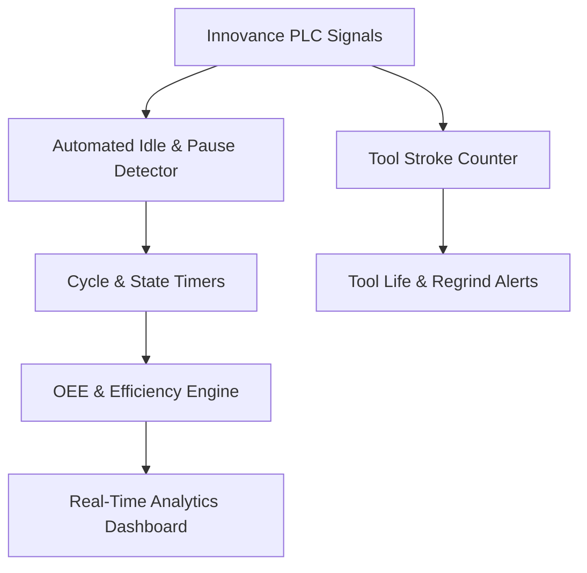
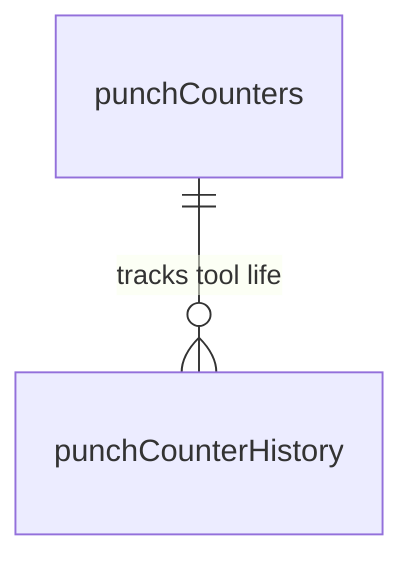

# Production Analytics, OEE & KPIs

---

## 1. Overview
The MES Analytics engine provides real-time manufacturing intelligence, Overall Equipment Effectiveness (OEE) calculations, automated downtime detection, and tool life tracking for high-volume angle iron fabrication.



---

## 2. Automated Idle Time & Pause Detection

### 2.1 Automated Idle Condition Logic
The system monitors low-level hydraulic and drive state tags directly from the PLC. When the machine enters a dormant state where hydraulic pressure is dumped and servo drives are inactive:

$$\text{Idle Condition} = (Q_{\text{SV\_LOW\_PRESSURE}} = \text{False} \lor \text{ACCUMULATOR\_CHARGE\_SV} = \text{True}) \land (Q_{\text{SV\_HIGH\_PRESSURE}} = \text{False}) \land (I_{\text{PRINCHER\_HYD\_MOTOR\_RUN}} = \text{False}) \land (S_{\text{SERVO\_RUNNING}} = \text{False})$$

* **Idle Threshold Rule**: If the Idle Condition persists for longer than `idleThresholdSec` (configurable, default: $20\text{ seconds}$), the system records an idle downtime period and presents a mandatory reason prompt to the operator.

### 2.2 Auto-Cycle Pause Reason Tracking
* When `10:AUTO_ON_GO` drops from `TRUE` to `FALSE` before the last operation of the bar is completed, the cycle timer pauses.
* If the pause duration exceeds `pauseThresholdSec` (configurable, default: $45\text{ seconds}$), the HMI requires the operator to select a categorized downtime reason (e.g. *Raw Material Loading*, *Punch Die Jam*, *Drawing Clarification*, *Hydraulic Filter Check*) before auto-cycle can be resumed.

---

## 3. Angle Iron Theoretical Weight Calculation

During program alignment and after each bar cut, theoretical steel weight is computed automatically based on angle dimensions and structural steel density ($\rho = 7861\text{ kg/m}^3$):

$$\text{Weight (kg)} = \frac{(W_A + W_B - T) \times T \times L \times 7861}{10^9}$$

*(Or standard nominal formula: $\text{Weight (kg)} = \frac{(W_A + W_B) \times T \times L \times 7861}{10^9}$)*

Where:
* $W_A, W_B$: Side A and Side B flange widths in millimeters ($mm$)
* $T$: Flange thickness in millimeters ($mm$)
* $L$: Finished part cut length in millimeters ($mm$)

---

## 4. OEE & Performance Metrics

### 4.1 Operator Efficiency
Measures active CNC production time relative to operator shift login duration:

$$\text{Operator Efficiency (\%)} = \left( \frac{\text{Actual Auto Run Time}}{\text{Operator Shift Login Duration}} \right) \times 100\%$$

### 4.2 Machine Availability
$$\text{Machine Availability (\%)} = \left( \frac{\text{Shift Duration} - \text{Total Unplanned Downtime}}{\text{Shift Duration}} \right) \times 100\%$$

---

## 5. Tool Life Management (`punchCounters`)

Every hydraulic punch stroke and cutter stroke is tracked station-by-station:



### 5.1 Table: `punchCounters`
```sql
CREATE TABLE `punchCounters` (
    `counterId` INT UNSIGNED AUTO_INCREMENT PRIMARY KEY,
    `tenantId` INT UNSIGNED NOT NULL,
    `stationCode` VARCHAR(50) NOT NULL,        -- 'DA1', 'DA2', 'DA3', 'DB1', 'DB2', 'DB3', 'CUTTER'
    `toolSize` VARCHAR(50) NOT NULL,           -- e.g. 'Ø20mm'
    `currentHits` INT UNSIGNED NOT NULL DEFAULT 0,
    `warningLimit` INT UNSIGNED NOT NULL DEFAULT 10000,
    `maxLifeLimit` INT UNSIGNED NOT NULL DEFAULT 15000,
    `lastRegroundAt` DATETIME NULL,
    `status` ENUM('ok', 'warning', 'expired') DEFAULT 'ok'
);
```

### 5.2 Preventative Maintenance Trigger
* **Warning Limit reached** (e.g. 10,000 strokes): Yellow badge displayed on HMI indicating upcoming tool regrind.
* **Max Life Limit reached** (e.g. 15,000 strokes): Red warning requiring supervisor acknowledgement to prevent hole burring and die cracking.
