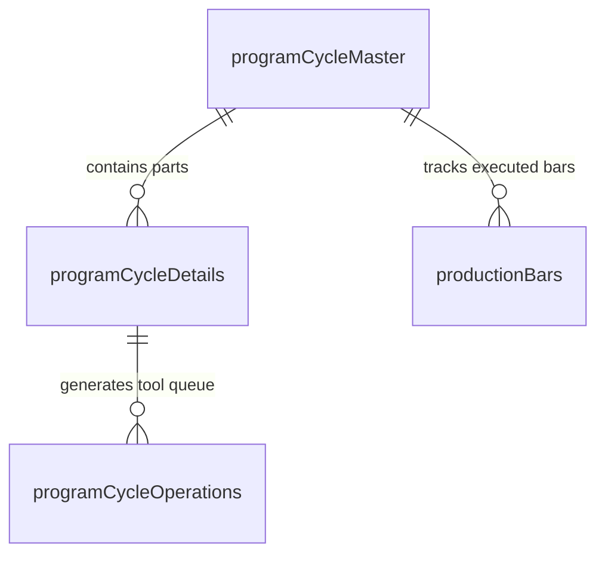

# Program Alignment & Nesting Engine

---

## 1. Overview
Angle iron bars are purchased in standard commercial raw mill lengths (typically $6\text{m}, 9\text{m}, 12\text{m}$). The **Program Alignment Engine (`programAlignMaster`)** groups multiple part recipes and target quantities onto a single raw steel bar to maximize material yield, minimize scrap, and generate a continuous execution queue for the CNC machine.

```
◄────────────────────────────────── Full Raw Bar Length (L_bar) ──────────────────────────────────►
┌─────────────┬──────────────────┬──────────────────┬──────────────────┬─────────────┐
│ Lead Scrap  │      Part 1      │      Part 2      │      Part 3      │Princher End │
│  (S_lead)   │   (Length L_1)   │   (Length L_2)   │   (Length L_3)   │ (S_princher)│
│ [Front Trim]│   [Punch/Mark]   │   [Punch/Mark]   │   [Punch/Mark]   │[Clamp Margin]
└─────────────┴──────────────────┴──────────────────┴──────────────────┴─────────────┘
```

---

## 2. Scrap Optimization & Mathematical Formulas

### 2.1 Scrap Definitions
1. **Lead Scrap ($S_{\text{lead}}$)**: The trim cut off from the front leading edge of the raw bar to eliminate mill edge deformities or torch-cut unevenness.
2. **Princher Scrap ($S_{\text{princher}}$)**: The tail remnant required by the servo carriage gripper to securely hold the bar during the final operations.
   - **Hard Physical Minimum**: $S_{\text{princher}} \ge 45.0\text{ mm}$ (mechanical gripper safety interlock).

### 2.2 Balance Equations
Given:
* Raw Bar Length: $L_{\text{bar}}$
* Sum of all part lengths in cycle: $L_{\text{parts}} = \sum_{i=1}^{n} (\text{Quantity}_i \times \text{Length}_i)$
* Total available scrap: $S_{\text{total}} = L_{\text{bar}} - L_{\text{parts}}$

#### Mode A: Lead Scrap Priority
When the operator specifies a custom Lead Scrap value ($S_{\text{lead}}$):
$$S_{\text{princher}} = L_{\text{bar}} - L_{\text{parts}} - S_{\text{lead}}$$
* **Validation Rule**: If $S_{\text{princher}} < 45.0\text{ mm}$, throw a **Bar Length Insufficient Error**.

#### Mode B: Princher Scrap Priority
When the operator sets a custom tail margin ($S_{\text{princher}} \ge 45.0\text{ mm}$):
$$S_{\text{lead}} = L_{\text{bar}} - L_{\text{parts}} - S_{\text{princher}}$$
* **Validation Rule**: If $S_{\text{lead}} < \text{defaultLeadScrap}$, alert the operator.

---

## 3. Alignment Database Schema



### 3.1 Table: `programCycleMaster`
```sql
CREATE TABLE `programCycleMaster` (
    `cycleId` INT UNSIGNED AUTO_INCREMENT PRIMARY KEY,
    `tenantId` INT UNSIGNED NOT NULL,
    `serialNo` INT UNSIGNED DEFAULT 0,
    `barLength` DECIMAL(10,2) NOT NULL,        -- e.g. 12000.00 mm
    `leadScrap` DECIMAL(10,2) NOT NULL,        -- e.g. 50.00 mm
    `princherScrap` DECIMAL(10,2) NOT NULL,    -- e.g. 65.00 mm
    `totalItems` INT NOT NULL DEFAULT 0,
    `totalOperations` INT NOT NULL DEFAULT 0,
    `completedCycles` INT NOT NULL DEFAULT 0,
    `machineSetup` JSON NULL,                  -- Snapshot of active tool setup
    `startedOn` DATETIME NULL,
    `completedOn` DATETIME NULL,
    `executedBy` INT UNSIGNED NULL,
    `createdAt` DATETIME NULL,
    `updatedAt` DATETIME NULL
);
```

### 3.2 Table: `programCycleDetails`
```sql
CREATE TABLE `programCycleDetails` (
    `cycleDetailsId` INT UNSIGNED AUTO_INCREMENT PRIMARY KEY,
    `tenantId` INT UNSIGNED NOT NULL,
    `serialNo` INT UNSIGNED DEFAULT 0,
    `cycleId` INT UNSIGNED NOT NULL,
    `itemRecipeId` INT UNSIGNED NOT NULL,
    `quantity` INT NOT NULL DEFAULT 1,
    `sequenceOrder` INT NOT NULL DEFAULT 0,
    `isReversed` TINYINT DEFAULT 0,            -- 1 = bar flipped 180°
    `isSwappedAB` TINYINT DEFAULT 0,           -- 1 = Side A and Side B swapped
    `isNoCut` TINYINT DEFAULT 0,               -- 1 = Skip cut-off for continuous piece
    FOREIGN KEY (`cycleId`) REFERENCES `programCycleMaster`(`cycleId`) ON DELETE CASCADE,
    FOREIGN KEY (`itemRecipeId`) REFERENCES `itemRecipeMaster`(`itemRecipeId`)
);
```

### 3.3 Table: `programCycleOperations` (Execution Queue)
Stores every pre-calculated tool stroke offset along the physical bar.

```sql
CREATE TABLE `programCycleOperations` (
    `operationId` BIGINT UNSIGNED AUTO_INCREMENT PRIMARY KEY,
    `tenantId` INT UNSIGNED NOT NULL,
    `serialNo` INT UNSIGNED DEFAULT 0,
    `cycleDetailsId` INT UNSIGNED NOT NULL,
    `machineDetailId` INT UNSIGNED NOT NULL,   -- Target station (DA1-3, DB1-3, Mark, Cut)
    `xPos` DECIMAL(10,3) NOT NULL,             -- Absolute machine infeed coordinate
    `yPos` DECIMAL(10,3) NOT NULL,             -- Transverse gauge position
    `status` ENUM('waiting', 'started', 'completed', 'skipped', 'error') DEFAULT 'waiting',
    `executedAt` DATETIME NULL,
    FOREIGN KEY (`cycleDetailsId`) REFERENCES `programCycleDetails`(`cycleDetailsId`) ON DELETE CASCADE
);
```

---

## 4. Advanced Transformations & Operator Features

1. **Side A/B Swap (`isSwappedAB`)**: Reverses flange definitions (moves all Side A punches to Side B and vice-versa) for symmetrical or opposing tower legs.
2. **Bar Inversion / Reverse Feed (`isReversed`)**: Mirrors the $X$-coordinates along the piece length ($X_{\text{mirrored}} = \text{Length} - X$), enabling fabrication starting from the opposite angle end.
3. **No-Cut Mode (`isNoCut`)**: When running a single prototype piece with quantity 1, disables the shearing blade operation to keep the full bar intact for inspection.
4. **Mid-Sequence Step Insertion**: Allows inserting supplemental holes or marking stamps into an aligned queue without re-parsing the original DAT master file.
