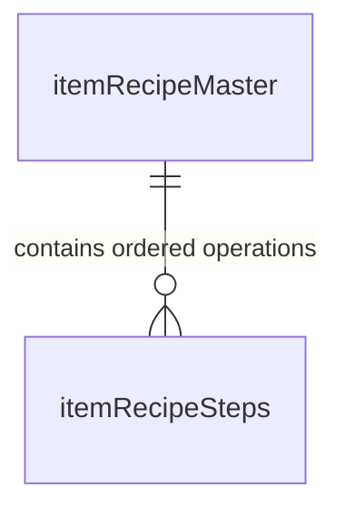

# Recipe & DAT File Parser Specification

---

## 1. Overview
The Recipe Management system (`ItemRecipeMaster` and `App\Libraries\RecipeParser`) parses standard CNC manufacturing files (such as DSTV and proprietary angle punch `.DAT` formats exported from CAD/CAM software like Tekla Structures, BOCAD, or SDS/2).

The parser converts human/machine-readable text files into structured database records containing absolute machine coordinates ($X, Y$), tool diameters, marking text, and cut-off points.

---

## 2. DAT File Syntax Reference

```
P:L100X100X10
M:E250BR
LP:2450.0
SA 100.0 SB 100.0 TA 10.0 TB 10.0
DA 20.0 X 50.0 TR 45.0
XI 100.0 TR 45.0
XI 100.0 TR 45.0
DB 20.0 X 50.0 TR 45.0
MK& TWR-L12 & X 300.0
M30
```

### 2.1 Token Specification

| Command Token | Example | Description | Parser Action |
| :--- | :--- | :--- | :--- |
| `P:<profile>` | `P:L100X100X10` | Angle profile designation | Saved in recipe metadata. |
| `M:<grade>` | `M:E250BR` | Steel material grade | Saved in recipe metadata. |
| `LP:<len>` | `LP:2450.0` | Total part finished length ($mm$) | Appends final shearing/cut step at $X = LP$. |
| `SA <w> SB <w> TA <a> TB <b>` | `SA 100 SB 100 TA 10 TB 10` | Flange widths & thickness | Sets Side A & B width and thickness. |
| `DA <d> X <x> TR <y>` | `DA 20.0 X 50.0 TR 45.0` | Side A Absolute Punch | Creates Side A punch step (Dia $= 20$, $X = 50$, $Y = 45$). |
| `DB <d> X <x> TR <y>` | `DB 20.0 X 50.0 TR 45.0` | Side B Absolute Punch | Creates Side B punch step (Dia $= 20$, $X = 50$, $Y = 45$). |
| `XI <inc> TR <y>` | `XI 100.0 TR 45.0` | Incremental Pitch Punch | Resolves absolute $X_{\text{new}} = X_{\text{prev}} + \text{inc}$ using current diameter context. |
| `DA <d> XI <inc> TR <y>` | `DA 25.0 XI 80.0 TR 50.0` | Inc Punch with Tool Switch | Switches Side A tool diameter and resolves absolute $X$. |
| `MK& <code>& X <x>` | `MK& TWR-L12 & X 300.0` | Alphanumeric Part Stamping | Creates Marking step at $X = 300$, $Y = 0$. |
| `M30` / `END` | `M30` | Program Termination | Closes parsing stream. |

---

## 3. Database Representation



### 3.1 Table: `itemRecipeMaster`
```sql
CREATE TABLE `itemRecipeMaster` (
    `itemRecipeId` INT UNSIGNED AUTO_INCREMENT PRIMARY KEY,
    `tenantId` INT UNSIGNED NOT NULL,
    `serialNo` INT UNSIGNED DEFAULT 0,
    `itemCode` VARCHAR(100) NOT NULL UNIQUE,
    `itemName` VARCHAR(255) NOT NULL,
    `sideAWidth` DECIMAL(10,2) NOT NULL,        -- Flange A width in mm
    `sideBWidth` DECIMAL(10,2) NOT NULL,        -- Flange B width in mm
    `thickness` DECIMAL(10,2) NOT NULL,         -- Angle thickness in mm
    `totalLength` DECIMAL(10,2) NOT NULL,       -- Total cut length in mm
    `measurementType` ENUM('absolute', 'incremental') DEFAULT 'absolute',
    `description` TEXT,
    `isActive` TINYINT DEFAULT 1,
    `createdAt` DATETIME NULL,
    `updatedAt` DATETIME NULL
);
```

### 3.2 Table: `itemRecipeSteps`
```sql
CREATE TABLE `itemRecipeSteps` (
    `itemRecipeStepId` INT UNSIGNED AUTO_INCREMENT PRIMARY KEY,
    `tenantId` INT UNSIGNED NOT NULL,
    `serialNo` INT UNSIGNED DEFAULT 0,
    `itemRecipeId` INT UNSIGNED NOT NULL,
    `ordId` INT NOT NULL DEFAULT 0,            -- Sequence order index
    `opType` ENUM('Punching', 'Marking', 'Cutting') NOT NULL,
    `side` ENUM('N/A', 'A', 'B') DEFAULT 'N/A',
    `opValue` VARCHAR(100) NOT NULL,           -- Diameter e.g. "20" or Marking text
    `xPos` DECIMAL(10,3) NOT NULL,             -- Absolute X in mm
    `yPos` DECIMAL(10,3) NOT NULL,             -- Absolute Y (gauge line) in mm
    `measurementType` ENUM('absolute', 'incremental') DEFAULT 'absolute',
    FOREIGN KEY (`itemRecipeId`) REFERENCES `itemRecipeMaster`(`itemRecipeId`) ON DELETE CASCADE
);
```

---

## 4. $Y$-Axis Safe Position & Root Clearance Algorithm

To prevent mechanical damage caused by the punch die colliding with the internal root fillet (heel) of the angle iron:

```
                  Side A Flange
                ◄─────────────►
               ┌──────────────┐ ▲
               │  (o) Punch   │ │ Gauge Line (Y)
               │              │ ▼
               └──┐        ┌──┘
    Heel / Root   │        │
    Fillet Zone   │        │
                  │  (o)   │ Side B Flange
                  │        │
                  └────────┘
```

### 4.1 Safety Mathematical Model
For each punch operation on flange $A$ or $B$:

$$\text{Minimum Safe Gauge Line } (Y_{\text{safe}}):$$

$$\text{If } \text{Flange Width } (W) > 50\text{ mm}: \quad Y_{\text{safe}} = 24.0\text{ mm} + \text{Thickness}$$

$$\text{If } \text{Flange Width } (W) \le 50\text{ mm}: \quad Y_{\text{safe}} = \left( \frac{\text{Punch Diameter}}{2} \right) + \text{Thickness}$$

$$\text{Maximum Permissible Gauge Line } (Y_{\max}): \quad Y_{\max} = W + 5.0\text{ mm}$$

### 4.2 Validation Execution
* During recipe creation or `.DAT` file import, any step violating $Y_{\text{safe}} \le Y \le Y_{\max}$ triggers a validation warning or block.
* Operators have an explicit "Skip Benchmark Validation" override if non-standard custom tooling is utilized.
