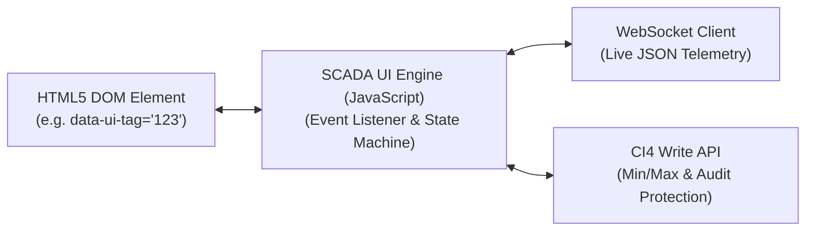

# UI Tag Master & SCADA Data Binding

---

## 1. Declarative SCADA UI Binding Concept
The frontend HMI does not use hardcoded PLC addresses or tight coupling with specific memory registers. Instead, it utilizes an abstraction layer called **UI Tag Master (`uiTagMaster`)**.

Every interactive element on the industrial touchscreen interface (pushbuttons, toggles, Digital Readouts, multi-state indicator lamps, gauges) is defined using declarative HTML5 `data-*` attributes.



---

## 2. Table: `uiTagMaster` & `tagWriteHistory`

### 2.1 Table: `uiTagMaster`
Maps visual controls to underlying physical PLC tags and applies client/server validation rules.

```sql
CREATE TABLE `uiTagMaster` (
    `uiTagId` INT UNSIGNED AUTO_INCREMENT PRIMARY KEY,
    `tenantId` INT UNSIGNED NOT NULL,
    `serialNo` INT UNSIGNED DEFAULT 0,
    `tagId` INT UNSIGNED NOT NULL,             -- FK to plcTagMaster
    `elementName` VARCHAR(100) NOT NULL,       -- Human-readable name
    `controlType` ENUM('momentary', 'maintain', 'latched', 'dro', 'input', 'dropdown', 'gauge') NOT NULL,
    `minValue` DECIMAL(10,3) NULL,             -- Minimum permissible write limit
    `maxValue` DECIMAL(10,3) NULL,             -- Maximum permissible write limit
    `unit` VARCHAR(20) NULL,                   -- e.g. "mm", "bar", "°C", "RPM"
    `decimalPlaces` INT DEFAULT 2,
    `activeColor` VARCHAR(20) DEFAULT '#28a745',
    `inactiveColor` VARCHAR(20) DEFAULT '#dc3545',
    `disableCondition` VARCHAR(255) NULL,      -- e.g. "AUTO_MODE_RUNNING==1"
    FOREIGN KEY (`tagId`) REFERENCES `plcTagMaster`(`tagId`) ON DELETE CASCADE
);
```

### 2.2 Table: `tagWriteHistory` (Audit Trail)
Every single manual or automated write command dispatched to the PLC is permanently logged with the operator ID, timestamp, target tag, and payload.

```sql
CREATE TABLE `tagWriteHistory` (
    `historyId` BIGINT UNSIGNED AUTO_INCREMENT PRIMARY KEY,
    `tagId` INT UNSIGNED NOT NULL,
    `value` VARCHAR(255) NOT NULL,
    `userId` INT UNSIGNED NOT NULL,
    `writeTime` DATETIME NOT NULL
);
```

---

## 3. Supported UI Control Types & HTML Specification

### 3.1 Momentary Push Button
* **Behavior**: Writes `1` (or `true`) on `mousedown` / `touchstart`, and automatically writes `0` (or `false`) on `mouseup` / `touchend` / `mouseleave`.
* **Use Case**: Hydraulic manual jog, inching feed forward/backward, manual cylinder advance.
* **HTML Markup**:
```html
<button class="btn plc-btn" 
        data-ui-tag="101" 
        data-plc-type="momentary"
        data-plc-indicator="102"
        data-active-class="btn-success"
        data-inactive-class="btn-outline-secondary">
    JOG SERVO FORWARD (X+)
</button>
```

### 3.2 Maintained Toggle Switch
* **Behavior**: Inverts current tag boolean state (`0` $\to$ `1`, `1` $\to$ `0`) on click.
* **Use Case**: Lubrication pump on/off, hydraulic power pack start/stop, coolant on/off.
* **HTML Markup**:
```html
<button class="btn plc-btn" 
        data-ui-tag="105" 
        data-plc-type="maintain"
        data-plc-indicator="105">
    HYDRAULIC PUMP TOGGLE
</button>
```

### 3.3 Digital Readout (DRO) / Output Display
* **Behavior**: Listens to WebSocket `tagValues` broadcasts and continuously updates inner text with formatted decimals.
* **Use Case**: Carriage actual position ($X$), punch cylinder pressure, hydraulic oil temperature.
* **HTML Markup**:
```html
<div class="dro-box">
    <span class="dro-label">ACTUAL X POSITION:</span>
    <span class="dro-value" data-ui-tag="201" data-plc-type="dro" data-decimals="2">0.00</span>
    <span class="dro-unit">mm</span>
</div>
```

### 3.4 Numeric Input Field with Safety Validation
* **Behavior**: Allows operator to enter values. Before dispatch, the backend verifies value is within `minValue` and `maxValue`.
* **Use Case**: Jog speed setpoint, target position offset, clamp pressure threshold.
* **HTML Markup**:
```html
<input type="number" 
       class="form-control plc-input" 
       data-ui-tag="305" 
       data-plc-type="input"
       min="10" 
       max="500" 
       step="0.5" />
```

---

## 4. Safety Limit & Interlock Enforcement

When `OpMasterFront::writeTags` receives a write request:
1. **Permission Check**: Verifies that the authenticated operator has `UiTagMaster.writeTag` permissions.
2. **Min/Max Boundary Validation**:
   $$\text{minValue} \le \text{Value} \le \text{maxValue}$$
   If the value falls outside this range, the backend immediately rejects the operation with an HTTP 400 error message without dispatching to the PLC.
3. **Audit Log Insertion**: Writes a record to `tagWriteHistory`.
4. **Dispatched to Gateway**: Encodes value according to PLC data type (`int16`, `float`, `bool`) and invokes NodeOpMaster API.
